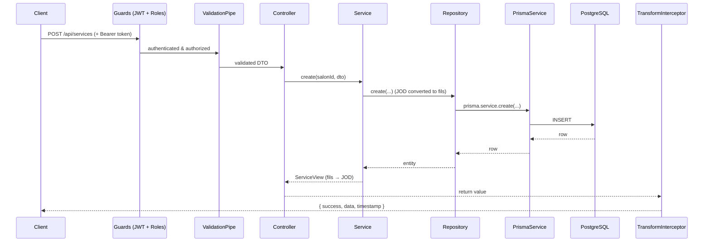
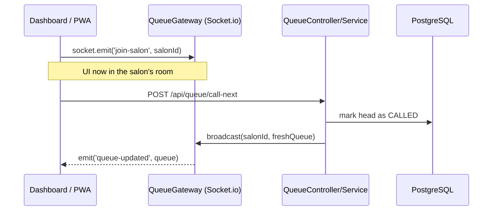

# Barber Dashboard API

NestJS + TypeScript backend for the **salon-owner dashboard**. It powers the
dashboard stats, calendar/bookings, live walk-in queue, services, staff,
analytics and clients features. Money is in **JOD**; auth is **JWT** with the
`SALON_OWNER` role.

> New to the codebase? Read [The request data flow](#the-request-data-flow)
> first — once you understand how one request travels through the layers,
> every module looks the same.

---

## Quick start

```bash
# 1. Install
npm install

# 2. Configure environment
cp .env.example .env        # then edit DATABASE_URL, REDIS_*, JWT_* secrets

# 3. Generate Prisma client + create the database schema
npx prisma generate
npx prisma migrate dev --name init

# 4. Seed demo data (creates a salon + owner login)
npm run db:seed

# 5. Run
npm run start:dev
```

- API base URL: `http://localhost:3001/api`
- Swagger docs: `http://localhost:3001/api/docs`
- Seed login: **owner@salon.com** / **password123**

You need a running **PostgreSQL** and **Redis** locally (or point the `.env`
at hosted instances).

---

## The big picture

```
                        ┌──────────────────────────────┐
   HTTP / WebSocket  →   │          NestJS app           │
                        │                                │
   Controller (HTTP)  ──┼─→ Service (business logic) ──┐ │
                        │                              │ │
   Gateway (Socket.io) ─┘                              ▼ │
                        │            Repository (abstract contract)
                        │                              │ │
                        │            PrismaService ────┼─┼──→ PostgreSQL
                        │            RedisService  ────┘ │──→ Redis
                        └──────────────────────────────┘
```

Three rules hold everywhere:

1. **Controllers do HTTP, services do logic, repositories do data.** Nothing
   skips a layer.
2. **Only `PrismaService` touches the database client.** Every service depends
   on an *abstract repository*, never on Prisma directly — so logic is testable
   and the data layer is swappable.
3. **Responses and errors are shaped globally**, so every endpoint returns the
   same envelope without any per-controller code.

---

## The request data flow

A request to `POST /api/services` travels top-to-bottom and the response comes
back up:

```
  Client request
       │
       ▼
  ┌─────────────────┐   1. JwtAuthGuard      verifies the Bearer access token
  │     GUARDS      │   2. RolesGuard         checks @Roles(SALON_OWNER)
  └─────────────────┘
       │
       ▼
  ┌─────────────────┐
  │ ValidationPipe  │   3. validates + transforms the DTO (class-validator)
  └─────────────────┘
       │
       ▼
  ┌─────────────────┐
  │   CONTROLLER    │   4. reads @SalonId(), calls the service. No logic here.
  └─────────────────┘
       │
       ▼
  ┌─────────────────┐
  │     SERVICE     │   5. business rules (JOD→fils, ownership checks, etc.)
  └─────────────────┘
       │
       ▼
  ┌─────────────────┐
  │   REPOSITORY    │   6. abstract contract → PrismaXRepository implementation
  └─────────────────┘
       │
       ▼
  ┌─────────────────┐
  │  PrismaService  │   7. the only place that talks to PostgreSQL
  └─────────────────┘
       │
       ▼  (data returns up the same path)
  ┌──────────────────────┐
  │ TransformInterceptor │   8. wraps the result: { success, data, timestamp }
  └──────────────────────┘
       │
       ▼
  Client response
```

If anything throws at any layer, **`AllExceptionsFilter`** catches it and
returns a uniform error envelope instead (it also maps Prisma errors — e.g.
unique-constraint → `409`, not-found → `404`).

The same flow as a sequence diagram (renders on GitHub):



### Success and error envelopes

```jsonc
// success
{ "success": true, "data": { /* ... */ }, "timestamp": "2026-..." }

// error
{ "success": false, "statusCode": 409, "message": "...", "path": "/api/services", "timestamp": "2026-..." }
```

---

## Project structure

```
src/
├── main.ts                  App bootstrap: global pipe, CORS, Swagger
├── app.module.ts            Wires modules + registers global guards/filter/interceptors
│
├── config/                  Typed env loading (configuration.ts) + Joi validation
├── prisma/                  PrismaService (the only DB client) + @Global module
├── redis/                   RedisService (cache + pub/sub) + @Global module
│
├── common/                  Cross-cutting code shared by every module
│   ├── decorators/          @CurrentUser, @SalonId, @Roles, @Public
│   ├── guards/              JwtAuthGuard, RolesGuard
│   ├── interceptors/        TransformInterceptor (envelope), LoggingInterceptor
│   ├── filters/             AllExceptionsFilter (uniform errors)
│   └── dto/                 PaginationDto, money.util (JOD ⇆ fils)
│
└── modules/                 One folder per feature, all the same shape
    ├── auth/                Login, JWT issue/refresh/rotate, logout
    ├── salons/              Salon profile (get/update)
    ├── dashboard/           Aggregated stat cards (Redis-cached)
    ├── bookings/            Calendar: CRUD, day/week, reschedule, status
    ├── queue/              Live walk-in queue + Socket.io gateway
    ├── services/            Service CRUD (the reference module to read first)
    ├── staff/               Staff + working hours + assigned services
    ├── analytics/           Revenue, top services, top clients (period strategy)
    └── clients/             Search, pagination, profile + history
```

### Every module has the same anatomy

```
<feature>/
├── <feature>.module.ts        declares controller, service, binds the repository
├── <feature>.controller.ts    HTTP routes only
├── <feature>.service.ts       business logic
├── repositories/
│   ├── <feature>.repository.ts        abstract class = the contract
│   └── prisma-<feature>.repository.ts  Prisma implementation
└── dto/                        request validation shapes
```

> **Start with `modules/services`.** It is the simplest end-to-end example of
> the pattern. Once it makes sense, every other module reads the same way.

---

## Design principles (SOLID, concretely)

| Principle | Where you see it |
|-----------|------------------|
| **S** — Single responsibility | Thin controllers, logic in services, data access in repositories |
| **O** — Open/closed | `analytics/period.strategy.ts`: add a new period by adding a map entry, no edits to the service |
| **L** — Liskov | Any `XRepository` implementation is interchangeable; services only know the abstract type |
| **I** — Interface segregation | Each repository exposes only the methods its service needs |
| **D** — Dependency inversion | Services depend on **abstract** repositories; `{ provide: XRepository, useClass: PrismaXRepository }` wires the concrete one in the module |

The dependency-inversion wiring is the one line worth internalising — it lives
in every `*.module.ts`:

```ts
providers: [
  ServicesService,
  { provide: ServicesRepository, useClass: PrismaServicesRepository },
]
```

Because `ServicesService` only ever sees the abstract `ServicesRepository`, the
unit test in `test/services.service.spec.ts` swaps in a plain mock — no
database, no Nest HTTP layer.

---

## Conventions worth knowing

**Money is stored as integer _fils_** (1 JOD = 1000 fils) to avoid floating
point errors. Conversion happens only at the API boundary via
`common/dto/money.util.ts` (`jodToFils` / `filsToJod`). The DB column is
`priceFils`; the API speaks `priceJod`.

**Tenant scoping.** Every owner has one salon. The `salonId` is embedded in the
JWT and read with the `@SalonId()` decorator, so queries are always scoped to
the caller's salon — controllers never trust a salonId from the request body.

**Auth routes are opt-out.** Guards are global; `login` / `refresh` are marked
`@Public()`.

---

## Live queue (real-time)

The queue is the only feature that pushes instead of being polled.



`QueueService.refreshAndBroadcast()` is the single choke point: every mutation
(join / call-next / cancel) re-reads the list and emits `queue-updated` to the
salon's room. Clients render from the socket event — no polling.

---

## Caching

`DashboardService` caches the overview payload in Redis for 60s under
`dashboard:stats:<salonId>`, and exposes `invalidate(salonId)` to clear it after
a mutation. This is the template for adding caching elsewhere.

---

## Testing

```bash
npm test
```

`test/services.service.spec.ts` demonstrates testing a service in isolation by
mocking its repository — the practical payoff of the repository abstraction.

---

## Scripts

| Script | Does |
|--------|------|
| `npm run start:dev` | Watch-mode dev server |
| `npm run build` / `npm run start:prod` | Compile / run compiled output |
| `npm run prisma:generate` | Generate the Prisma client |
| `npm run prisma:migrate` | Create/apply a dev migration |
| `npm run db:seed` | Seed the demo salon |
| `npm test` | Run unit tests |
